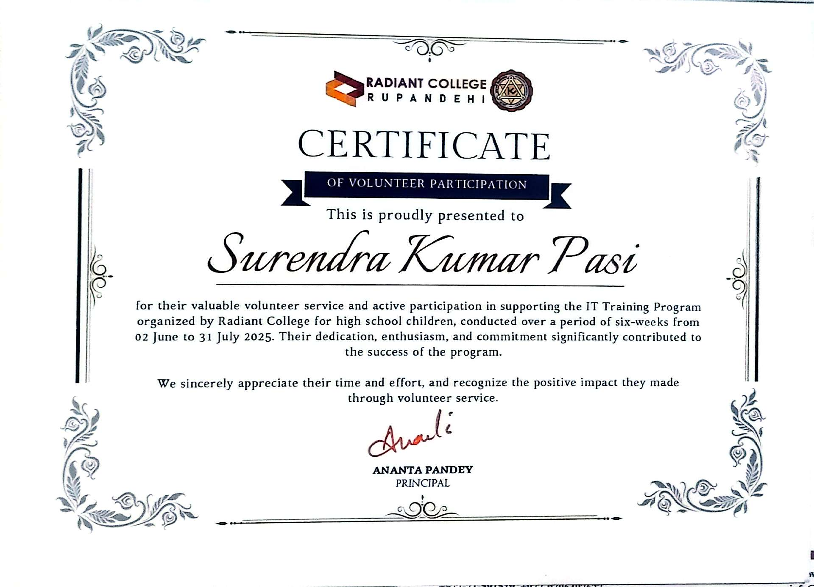

# 💫 About Me

<h1 align="center">Hi 👋, I'm Surendra Kumar Pasi</h1>
<h3 align="center">🚀 Passionate Full Stack Developer | IT Teacher | Tech Enthusiast from Nepal 🇳🇵</h3>

  

---

## 👨‍💻 Professional Summary
💡 Dedicated Full Stack Developer with strong knowledge of frontend and backend technologies.  
🎓 Information Technology teacher who enjoys sharing technical knowledge and mentoring students.  
⚙️ Experienced in building scalable web applications and software solutions.  
🌱 Always learning new technologies and improving development skills.  
⚡ Fun fact: I believe coding + teaching = happiness 😊  

---

## 🌐 Connect With Me

---

## 🛠️ Languages and Tools

### 💻 Programming Languages

---

### 🌐 Frontend Development

---

### ⚙️ Backend & Framework

---

### 🗄️ Database & Operating System

---

## 🏆 Achievements & Certifications

### 🥇 Code Fest 2025 – Code For Change
✔ Provincial Phase Participation Certificate  
✔ Contributed to innovative hackathon solutions  

---

### 🤝 Volunteer – Radiant College
✔ Assisted in HTML & CSS Training Program  
✔ Supported technical workshop coordination  

---

## 🎯 Career Goals
✔ Build impactful software solutions  
✔ Inspire students through technology education  
✔ Contribute to open-source development  
✔ Continue growing as a Full Stack Engineer  

---

⭐ *"Code with passion, teach with purpose, and learn every day."*
